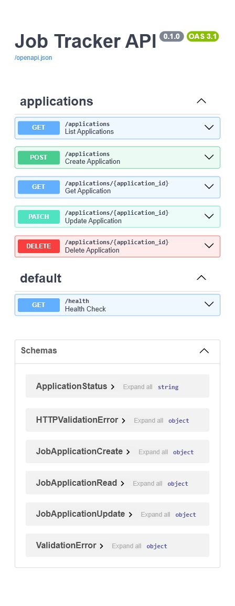

# Job Tracker API

[](https://github.com/Dexter2099/Job-Tracker/actions/workflows/tests.yml)

A FastAPI backend for tracking job applications, companies, recruiter contacts, interview stages, notes, and follow-up dates.

## Overview

Job Tracker API lets a user manage job applications through REST endpoints. The API validates request and response data with Pydantic, persists application, company, and contact data in PostgreSQL through SQLAlchemy models, and manages schema changes with Alembic migrations.

## Tech Stack

- FastAPI
- PostgreSQL
- SQLAlchemy
- Alembic
- pytest
- Docker
- GitHub Actions

## Features

- Create, read, update, and delete job applications
- Track company, role, location, application status, notes, and follow-up date
- Store companies in a first-class table linked from job applications
- Store recruiter/contact records linked to companies and applications
- Store first-class follow-up reminder records linked to applications
- Return weekly job-search statistics
- Export job applications as CSV
- Add request IDs to responses and structured request logs
- Filter applications by status, company, and follow-up date
- Store status changes over time in a status history table
- Add notes to each application
- Validate incoming API requests with Pydantic
- Run automated tests with pytest
- Run locally with Docker Compose

## Architecture

```text
Client
  -> FastAPI route
  -> Pydantic schema validation
  -> SQLAlchemy model/session
  -> PostgreSQL tables
       - companies
       - contacts
       - job_applications
       - follow_up_reminders
       - application_status_history
```

Alembic tracks database migrations, including the normalized `companies` and
`contacts` tables, follow-up reminder records, and application foreign keys.
GitHub Actions runs the pytest suite on pushes and pull requests.

## Local Development

Clone the repository:

```powershell
git clone https://github.com/Dexter2099/Job-Tracker.git
cd Job-Tracker
```

Install dependencies:

```powershell
pip install -r requirements.txt
```

Run the API:

```powershell
uvicorn app.main:app --reload
```

Open the API docs:

```text
http://127.0.0.1:8000/docs
```

Run tests:

```powershell
pytest -v
```

Run database migrations:

```powershell
alembic upgrade head
```

Seed local demo data:

```powershell
python scripts/seed_data.py
```

The seed script creates a small fixed demo dataset for Swagger walkthroughs,
weekly stats, reminders, and CSV export. It is safe to run more than once:
known seed records are skipped instead of duplicated.

## Docker

Run the API and PostgreSQL:

```powershell
docker compose up --build
```

Apply migrations after the database is running:

```powershell
alembic upgrade head
```

Open the API docs:

```text
http://127.0.0.1:8000/docs
```

Health check:

```text
GET /health
```

Expected response:

```json
{
  "status": "ok"
}
```

## Production Behavior

Every response includes an `X-Request-ID` header. If the client sends
`X-Request-ID`, the API reuses it; otherwise it generates a UUID4 value. Each
request also emits one JSON log line through the `job_tracker.requests` logger
with `request_id`, `method`, `path`, `status_code`, and `duration_ms`.

Handled errors use a consistent response shape:

```json
{
  "error": {
    "code": "not_found",
    "message": "Application not found",
    "details": null,
    "request_id": "..."
  }
}
```

## Screenshots

### Swagger UI



## API Endpoints

| Method | Endpoint | Description |
| --- | --- | --- |
| `GET` | `/health` | Check API health |
| `POST` | `/applications` | Create a job application |
| `GET` | `/applications` | List job applications |
| `GET` | `/applications/export.csv` | Export job applications as CSV |
| `GET` | `/applications/{id}` | Get one job application |
| `GET` | `/applications/{id}/status-history` | List status history for one job application |
| `POST` | `/applications/{id}/follow-up-reminders` | Create a follow-up reminder |
| `GET` | `/applications/{id}/follow-up-reminders` | List follow-up reminders |
| `PATCH` | `/applications/{id}/follow-up-reminders/{reminder_id}` | Mark a reminder completed |
| `PATCH` | `/applications/{id}` | Partially update a job application |
| `DELETE` | `/applications/{id}` | Delete a job application |
| `GET` | `/stats/weekly` | Return weekly application and follow-up statistics |

### List Applications

```text
GET /applications
```

Supported filters:

```text
GET /applications?status=interview
GET /applications?company=Atlassian
GET /applications?follow_up_before=2026-06-15
GET /applications?needs_follow_up_by=2026-06-15
```

`needs_follow_up_by` returns applications with a follow-up date due on or before
the supplied date.

Pagination:

```text
GET /applications?limit=20&offset=0
GET /applications?status=interview&limit=10&offset=20
```

`limit` defaults to `20` and accepts values from `1` to `100`. `offset`
defaults to `0`.

### Export Applications

```text
GET /applications/export.csv
GET /applications/export.csv?status=interview&company=Canva
```

The response is `text/csv` with a `Content-Disposition` attachment header and
these columns:

```text
id,company,role_title,location,status,applied_date,follow_up_date,contact_name,contact_email,notes,created_at,updated_at
```

### Get Application

```text
GET /applications/{id}
```

### Status History

When an application's `status` changes, the API stores a row in
`application_status_history` with the previous status, new status, change
timestamp, and the update note when one is provided.

```text
GET /applications/{id}/status-history
```

Status history is returned newest first.

### Follow-Up Reminders

Applications still support the simple `follow_up_date` field. For durable
follow-up tracking, reminders can also be stored as first-class records linked
to an application.

```text
POST /applications/{id}/follow-up-reminders
```

Example request:

```json
{
  "reminder_date": "2026-06-18",
  "note": "Send polite follow-up."
}
```

```text
GET /applications/{id}/follow-up-reminders
PATCH /applications/{id}/follow-up-reminders/{reminder_id}
```

Mark a reminder completed:

```json
{
  "completed": true
}
```

### Weekly Stats

```text
GET /stats/weekly
GET /stats/weekly?start_date=2026-06-01&end_date=2026-06-07
```

Example response:

```json
{
  "week_start": "2026-06-01",
  "week_end": "2026-06-07",
  "applications_sent": 4,
  "interviews": 1,
  "rejections": 1,
  "offers": 1,
  "follow_ups_due": 2,
  "overdue_follow_ups": 1
}
```

### Create Application

```text
POST /applications
```

The public API still accepts a `company` string for a job application. Internally,
the API creates or reuses a matching row in `companies` and links the application
with `job_applications.company_id`. Optional `contact_name` and `contact_email`
fields create or reuse a linked `contacts` row for that company.

Example request:

```json
{
  "company": "Atlassian",
  "role_title": "Junior Backend Developer",
  "location": "Sydney",
  "job_url": "https://example.com/jobs/backend",
  "status": "applied",
  "source": "LinkedIn",
  "contact_name": "Priya Shah",
  "contact_email": "priya@example.com",
  "salary_range": "$80,000-$95,000",
  "notes": "Applied after tailoring resume.",
  "follow_up_date": "2026-06-15",
  "applied_date": "2026-05-31"
}
```

Example response:

```json
{
  "id": 1,
  "company": "Atlassian",
  "role_title": "Junior Backend Developer",
  "location": "Sydney",
  "job_url": "https://example.com/jobs/backend",
  "status": "applied",
  "source": "LinkedIn",
  "contact_name": "Priya Shah",
  "contact_email": "priya@example.com",
  "salary_range": "$80,000-$95,000",
  "notes": "Applied after tailoring resume.",
  "follow_up_date": "2026-06-15",
  "applied_date": "2026-05-31",
  "created_at": "2026-06-01T04:12:38.411147Z",
  "updated_at": "2026-06-01T04:12:38.411147Z"
}
```

### Update Application

```text
PATCH /applications/{id}
```

Example request:

```json
{
  "status": "interview",
  "contact_name": "Jordan Lee",
  "contact_email": "jordan@example.com",
  "notes": "Phone screen booked.",
  "follow_up_date": "2026-06-20"
}
```

Example response:

```json
{
  "id": 1,
  "company": "Atlassian",
  "role_title": "Junior Backend Developer",
  "location": "Sydney",
  "job_url": "https://example.com/jobs/backend",
  "status": "interview",
  "source": "LinkedIn",
  "contact_name": "Jordan Lee",
  "contact_email": "jordan@example.com",
  "salary_range": "$80,000-$95,000",
  "notes": "Phone screen booked.",
  "follow_up_date": "2026-06-20",
  "applied_date": "2026-05-31",
  "created_at": "2026-06-01T04:12:38.411147Z",
  "updated_at": "2026-06-01T04:12:38.446502Z"
}
```

### Delete Application

```text
DELETE /applications/{id}
```

Successful deletes return:

```text
204 No Content
```

## Interview Explanation

Job Tracker API is a FastAPI backend for managing job applications. A client sends HTTP requests to API endpoints, Pydantic validates and serializes request and response data, the route layer handles the API operation, SQLAlchemy maps Python models to PostgreSQL tables, and Alembic manages database schema changes over time. The project uses pytest for API behavior tests, Docker Compose for local PostgreSQL development, and GitHub Actions for continuous integration.
